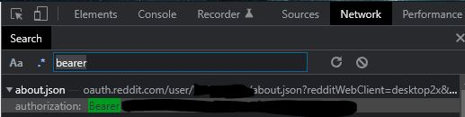

# reddit-place-2022
Testing interaction with Reddit's r/place for 2022

Currently this tool is solely for fetching the image URLs used to render the current state of r/place.

# Help Wanted
- Automatically fetching the Bearer Token, presumably via logging into Reddit on the user's behalf?
- Submitting or engaging with the Websocket/place in a more substantive way, such as for marking pixels automatically

# Installation
Install Go 1.18, clone this repo, and run `go build main.go` (builds executable) or `go run main.go`

# Usage
Find your Reddit Bearer Token, and supply it via the `REDDIT_BEARER_TOKEN` environment variable. 

This can be found by searching the Network tab of Google Chrome
when logged in to https://new.reddit.com/r/place, and searching for "Bearer" like so:

Double-click the blacked-out value, and it should pop out on the right panel. Copy that value and use it to supply the 
required `REDDIT_BEARER_TOKEN` env variable.